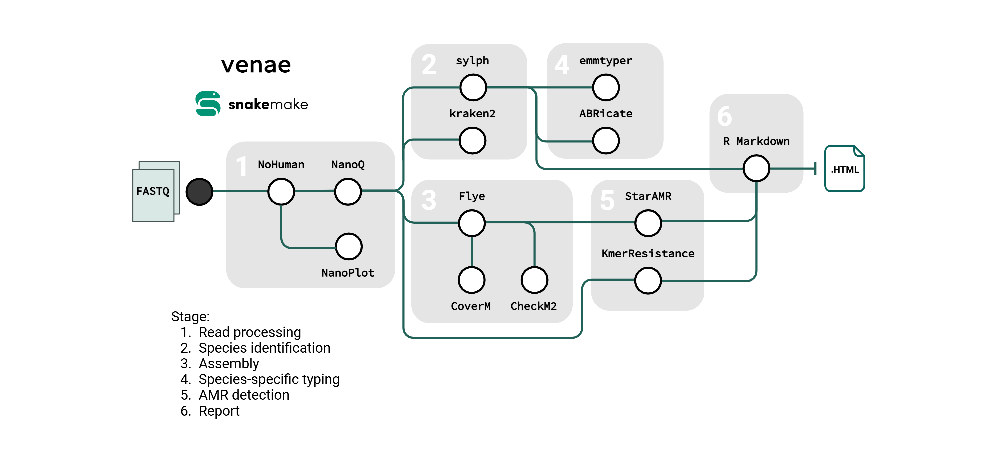

# venae

**venae** is a [Snakemake](https://snakemake.readthedocs.io/en/stable/) bioinformatic workflow to identify species and antimicrobial resistance genes in positive blood cultures sequenced using Oxford Nanopore Technologies (ONT). This pipeline is designed to generate results as rapidly as possible and outputs a clinician-/infectious disease specialist-friendly HTML report summarizing the results. **venae** is Latin for "blood vessels", which serve as pipelines to move blood through the body. 

This repository is the product of a GRDI-funded research project entitled **Rapid identification of bacterial and fungal pathogens and resistance determinants directly from positive blood culture bottles using whole genome sequencing, a path towards point of care diagnostics**. Currently, the gold standard for bloodstream infection diagnostics is culturing blood vials followed by phenotypic methods for organism identification and antimicrobial susceptibility testing, which can take days. The significance of early pathogen detection and appropriate antimicrobial therapy for bloodstream infections have major impacts on patient survival; early administration of effective antimicrobials reduces mortality, morbidity, cost of treatment, length of hospital stay, and development of antimicrobial resistance. This project aims to improve the methodologies used for DNA isolation and whole genome sequencing, as well as optimize a bioinformatic pipeline that achieves the highest accuracy results while maintaining short turn around times, with the overall goal to reduce the diagnostic turn around time from days to hours. 

## Big picture overview

**venae** includes a combination of tools that are used to remove host reads, assess quality, perform *de novo* assembly, identify species (bacteria and fungi), and determine antimicrobial resistance (AMR) genes. Briefly, human reads are removed from samples, subsequently filtered for length, and then submitted to a taxonomic classifier and profiler for species detection. Reads are assembled and contigs are searched against databases of AMR genes. Typing for specific organisms (*emm* typing for *Streptococcus pyogenes*, and toxin typing for *Staphylococcus aureus*) is included. A final report summarizing sequencing quality, organism identity, and antimicrobial resistance determinants is output in an HTML file. 



## Installation

Detailed installation instructions can be found in [the installation documentation here](docs/installation.md).

Installation requires [Snakemake](https://snakemake.readthedocs.io/en/stable/) version > 8 and the [conda](https://docs.conda.io/en/latest/miniconda.html) dependency management system to run. In addition, this workflow depends on several external databases which should be downloaded prior to initially running the pipeline.

Steps:

1. Download and install Snakemake 
    
    1. Download and install with conda: 
        - Command: `conda create -n snakemake -c bioconda -c conda-forge snakemake`
    2. Use the included snakemake conda environment file: 
        - Command: `conda create -n snakemake -f workflow/envs/snakemake_v8.25.3.yml`

2. Clone the repository
    
    1. Command: `git clone https://<pipeline repository path>.git`

3. Download the required databases
    
    1. Navigate to the downloaded repository and run the included database download script: 
        - Command: `bash workflows/scripts/download_databases.sh`
        - **Note** by default this will store the databases in the `resources/` folder. The paths to the databases can be changed in the configuration files if these databases already exist.  

## Resource requirements

By default, several resource-intensive steps have a minimum resource usage allocation set to the following:

| Tool | CPUs | Memory |
| :--- | :--- | :--- |
| `sylph` | 8 | 14 Gb |
| `kraken2` | 8 | 8 Gb |
| `CheckM2` | 8 | 12 Gb |
| `Flye` | 8 | 2 Gb |
 
These can be overriden during the pipeline command following Snakemake usual syntax (`--set-resources`, `--set-threads`,`--set-default-resources`, etc.) or by [including a custom profile](https://snakemake.readthedocs.io/en/stable/executing/cli.html#profiles). Note that `sylph` and `kraken2` load the entire database into memory (14 Gb and 8 Gb respectively), and run time will decrease the more cores are used if running multiple samples. 

This pipeline can be run on high-performance computing clusters with a [specific profile](https://github.com/snakemake-profiles/). Included in `slurm/` is an example of a profile for slurm-managed clusters. If running on a high-performance computing cluster, additional Snakemake plugins are needed. See the [Snakemake plugin catalog](https://snakemake.github.io/snakemake-plugin-catalog/index.html) for more information.

## Quick usage

Detailed usage instructions are found in [the usage documentation here](docs/usage.md). 

To start the workflow with the test dataset, ensure Snakemake is accessible and run the following command from the cloned repository:

```bash
snakemake --profile <PROFILE> --cores <JOBS>
```

where:
- `--profile <PROFILE>`: the Snakemake profile to use, which includes specifying the conda dependency management system
- `--cores <JOBS>`: the number of jobs that will run concurrently

This will begin the pipeline using the `config/samples.tsv` file to specify the sample names and paths to two samples in the `test/` folder.

> :exclamation: This pipeline depends on several external databases which must be downloaded before use. See [the installation docs](docs/installation.md#database-installation) for instructions on how to do so.

## Quick output 

Descriptions of all outputs from **venae** can be found in the [the output documentation here](docs/output.md). The `report.html` final report is output in the working directory, which can be viewed through a web browser. All other detailed and sample-specific outputs are put in the `results/` folder by default. An example output report can be found in `test/report.html`.

## Configuration files 

A configuation file `config.yaml` has been included in the `config/` folder. It includes tool parameters and database paths which can be customized. See [here](config/README.md) for more information.

This workflow uses a sample sheet as input. The sample sheet is found in `config/samples.tsv` and should look like this: 

| sample |  reads |
| :--- | :--- |
| sample01 | path/to/sample01/reads.fastq |
| sample02 |  path/to/sample02/reads.fastq |

The `sample` column is the sample identifier, and will be use to name output files and will be listed in the final report. The `reads` column is a path to the corresponding long-read fastq file for each sample. This file can be gzipped but it is not required. 

## Documentation

- [Installation](docs/installation.md)
- [Configuration](config/README.md)
- [Usage](docs/usage.md)
- [Output](docs/output.md)
- [Tools](docs/tools.md)

## Limitations

This pipeline is intended to be run on Oxford Nanopore Technologies long read sequencing data, and is not designed to be compatible with paired-end Illumina data nor with PacBio HiFi reads. 

## Contributing

Contributions are welcome through creating pull requests or issues.

## Citations

Detailed citations for included tools are found [here](CITATIONS.md). 

## Legal

Copyright 2025 Government of Canada

Licensed under the Apache License, Version 2.0 (the "License"); you may not use this work except in compliance with the License. You may obtain a copy of the License at:

http://www.apache.org/licenses/LICENSE-2.0

Unless required by applicable law or agreed to in writing, software distributed under the License is distributed on an "AS IS" BASIS, WITHOUT WARRANTIES OR CONDITIONS OF ANY KIND, either express or implied. See the License for the specific language governing permissions and limitations under the License.

## Contact

Nicole Lerminiaux: nicole.lerminiaux[at]phac-aspc.gc.ca or nml.arni-rain.lnm[at]phac-aspc.gc.ca
