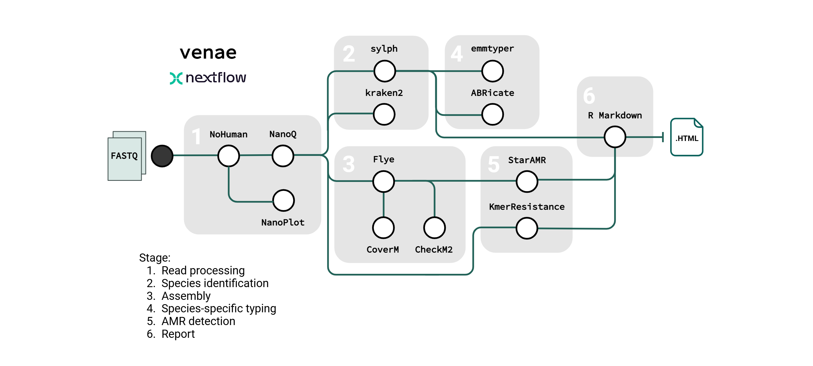

# venae

[](https://github.com/phac-nml/venae/actions/workflows/ci.yml)
[](https://github.com/phac-nml/venae/actions/workflows/linting.yml)
[](https://www.nf-test.com)

[](https://www.nextflow.io/)
[](https://docs.conda.io/en/latest/)
[](https://sylabs.io/docs/)

**venae** is a [Nextflow](https://www.nextflow.io/) bioinformatic workflow to identify species and antimicrobial resistance genes in positive blood cultures sequenced using Oxford Nanopore Technologies (ONT). This pipeline is designed to generate results as rapidly as possible and outputs a clinician-/infectious disease specialist-friendly HTML report summarizing the results. **venae** is Latin for "blood vessels", which serve as pipelines to move blood through the body.

This repository is the product of a GRDI-funded research project entitled **Rapid identification of bacterial and fungal pathogens and resistance determinants directly from positive blood culture bottles using whole genome sequencing, a path towards point of care diagnostics**. Currently, the gold standard for bloodstream infection diagnostics is culturing blood vials followed by phenotypic methods for organism identification and antimicrobial susceptibility testing, which can take days. The significance of early pathogen detection and appropriate antimicrobial therapy for bloodstream infections have major impacts on patient survival; early administration of effective antimicrobials reduces mortality, morbidity, cost of treatment, length of hospital stay, and development of antimicrobial resistance. This project aims to improve the methodologies used for DNA isolation and whole genome sequencing, as well as optimize a bioinformatic pipeline that achieves the highest accuracy results while maintaining short turn around times, with the overall goal to reduce the diagnostic turn around time from days to hours.

Our preprint is accessible on bioRxiv [here](https://doi.org/10.64898/2025.12.12.694010).

## Big picture overview

**venae** includes a combination of tools that are used to remove host reads, assess quality, perform _de novo_ assembly, identify species (bacteria and fungi), and determine antimicrobial resistance (AMR) genes. Briefly, human reads are removed from samples, subsequently filtered for length, and then submitted to a taxonomic classifier and profiler for species detection. Reads are assembled and contigs are searched against databases of AMR genes. Typing for specific organisms (_emm_ typing for _Streptococcus pyogenes_, and toxin typing for _Staphylococcus aureus_) is included. A final report summarizing sequencing quality, organism identity, and antimicrobial resistance determinants is output in an HTML file.



1. Read processing ([`nohuman`](https://github.com/mbhall88/nohuman), [`nanoq`](https://github.com/esteinig/nanoq), and [`NanoPlot`](https://github.com/wdecoster/NanoPlot))
2. Species identification ([`sylph`](http://multiqc.info/) and [`Kraken2`](https://github.com/DerrickWood/kraken2))
3. Assembly ([`Flye`](https://github.com/mikolmogorov/Flye))
4. Species-specific typing ([`emmtyper`](https://github.com/MDU-PHL/emmtyper) and [`ABRicate`](https://github.com/tseemann/abricate))
5. AMR detection ([`StarAMR`](https://github.com/phac-nml/staramr), [`ChroQueTas`](https://github.com/nmquijada/ChroQueTas), and [`KmerResistance`](https://bitbucket.org/genomicepidemiology/kmerresistance/src/master/))
6. Report

## Installation

Detailed installation instructions can be found in [the installation documentation here](docs/installation.md).

Installation requires [Nextflow](https://www.nextflow.io/) (minimum version tested 24.04.4) and the [conda](https://docs.conda.io/en/latest/miniconda.html) dependency management system to run. In addition, this workflow depends on several external databases which should be downloaded prior to initially running the pipeline.

Steps:

1. Download and install Nextflow

   1. Download and install with conda:
      - Command: `conda create -n nextflow -c bioconda -c conda-forge nextflow`

2. Clone the repository

   1. Command: `git clone https://<pipeline repository link>.git`

3. Download the required databases

   1. Navigate to the downloaded repository and run the included database download script:
      - Command: `bash bin/download_databases.sh`
      - **Note** by default this will store the databases in the `data/` folder. The paths to the databases can be changed in the configuration files if these databases already exist.

4. Run the pipeline with one of the following profiles to handle dependencides or [use your own profile](https://nf-co.re/docs/usage/getting_started/configuration) if applicable:

- `conda`
- `singularity`
- `mamba`

## Quick usage

Detailed usage instructions are found in [the usage documentation here](docs/usage.md).

To start the workflow with the test dataset, ensure Nextflow is accessible and run the following command from the cloned repository:

```bash
nextflow run main.nf \
   -profile <PROFILE> \
   --input <PATH/TO/SAMPLESHEET.tsv> \
   --outdir <OUTDIR>
```

where:

- `-profile <PROFILE>`: the Nextflow profile to use, which includes specifying the dependency management system (conda, singularity)
- `--input <PATH/TO/SAMPLESHEET.tsv>`: Path to a TSV file with column headers `sample` and `reads`, see example [here](test/samples.tsv)
  - `sample`: name of the sample which will be printed in all results
  - `reads`: path to the long-read .fastq/.fq/fastq.gz/fq.gz file
- `--outdir <OUTDIR>`: name of the output folder containing the results

> :exclamation: This pipeline depends on several external databases which must be downloaded before use. See [the installation docs](docs/installation.md#database-installation) for instructions on how to do so.

## Quick output

Descriptions of all outputs from **venae** can be found in the [the output documentation here](docs/output.md). The `report.html` final report is output in the working directory, which can be viewed through a web browser. All other detailed and sample-specific outputs are put in the `results/` folder by default. An example can be found [here](test/report.html).

## Configuration files

This pipeline has multiple parameters which can be modified as described in the configuration docs [here](docs/config.md). To quickly view all parameters and defaults, run:

```bash
nextflow run main.nf --help
```

## Resource requirements

By default, the `sylph`, `kraken2`, and `checkm2` processes have minimum resource usage set to `4 cpus` and `24GB memory` using the nf-core `process-medium` label. In addition, the `flye` and `nanoplot` processes have minimum resource usage set to `8 cpus` and `6GB memory` using the custom `process-cpus` label.

This can be adjusted (along with the other labels) by creating and passing a custom configuration file with -c <config> or by adjusting the `--max_cpus` and `--max_memory` parameters. More info can be found in the usage docs [here](docs/usage.md).

If resources are limiting, the memory can be lowered based on the size of the required databases, which can be found in the installation docs [here](docs/installation.md).

## Documentation

- [Installation](docs/installation.md)
- [Configuration](docs/config.md)
- [Usage](docs/usage.md)
- [Output](docs/output.md)
- [Tools](docs/tools.md)

## Limitations

This pipeline is intended to be run on Oxford Nanopore Technologies long read sequencing data, and is not designed to be compatible with paired-end Illumina data nor with PacBio HiFi reads.

## Credits

The collaborators of the GRDI-funded research project that allowed development of this pipeline are Nicole Lerminiaux, Ken Fakharuddin, Heather Adam, Amrita Bharat, George R. Golding, Irene Martin, Michael Mulvey, and Laura Mataseje.

## Contact

Nicole Lerminiaux: nicole.lerminiaux[at]phac-aspc.gc.ca or nml.arni-rain.lnm[at]phac-aspc.gc.ca

## Contributions and Support

Contributions are welcome through creating pull requests or issues. If you would like to contribute to this pipeline, please see the [contributing guidelines](.github/CONTRIBUTING.md).

## Citations

Our preprint is accessible here:

> Nicole Lerminiaux, Ken Fakharuddin, Heather J Adam, Amrita Bharat, George R Golding, Irene Martin, Michael Mulvey, & Laura Mataseje.
>
> Rapid identification of microbial pathogens and antimicrobial resistance from bloodstream infections using long-read sequencing.
>
> 2025 Dec 15. bioRxiv, doi: https://doi.org/10.64898/2025.12.12.694010

Detailed citations for included tools can be found in the [`CITATIONS.md`](CITATIONS.md) file.

This pipeline uses code and infrastructure developed and maintained by the [nf-core](https://nf-co.re) community, reused here under the [MIT license](https://github.com/nf-core/tools/blob/main/LICENSE).

> **The nf-core framework for community-curated bioinformatics pipelines.**
>
> Philip Ewels, Alexander Peltzer, Sven Fillinger, Harshil Patel, Johannes Alneberg, Andreas Wilm, Maxime Ulysse Garcia, Paolo Di Tommaso & Sven Nahnsen.
>
> Nat Biotechnol. 2020 Feb 13. doi: 10.1038/s41587-020-0439-x.

## Legal

Copyright 2025 Government of Canada

Licensed under the Apache License, Version 2.0 (the "License"); you may not use this work except in compliance with the License. You may obtain a copy of the License at:

http://www.apache.org/licenses/LICENSE-2.0

Unless required by applicable law or agreed to in writing, software distributed under the License is distributed on an "AS IS" BASIS, WITHOUT WARRANTIES OR CONDITIONS OF ANY KIND, either express or implied. See the License for the specific language governing permissions and limitations under the License.
a